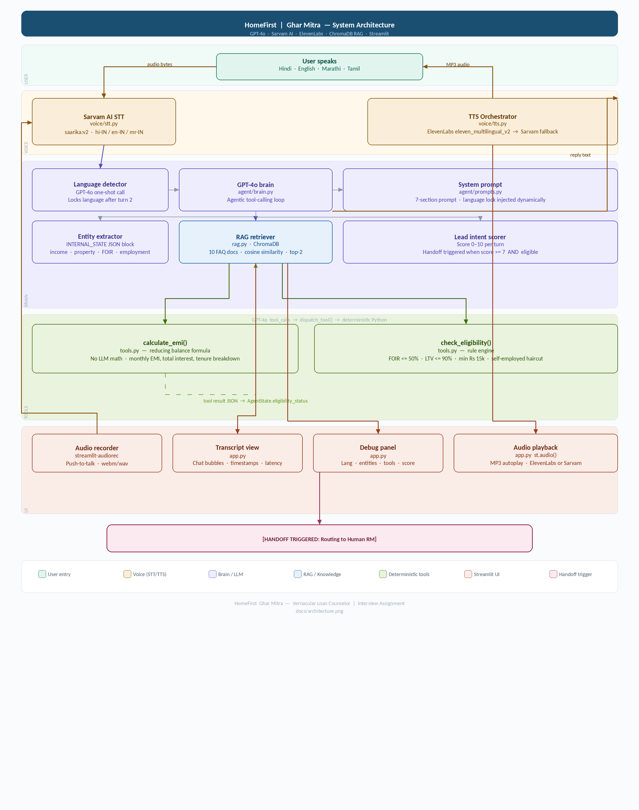
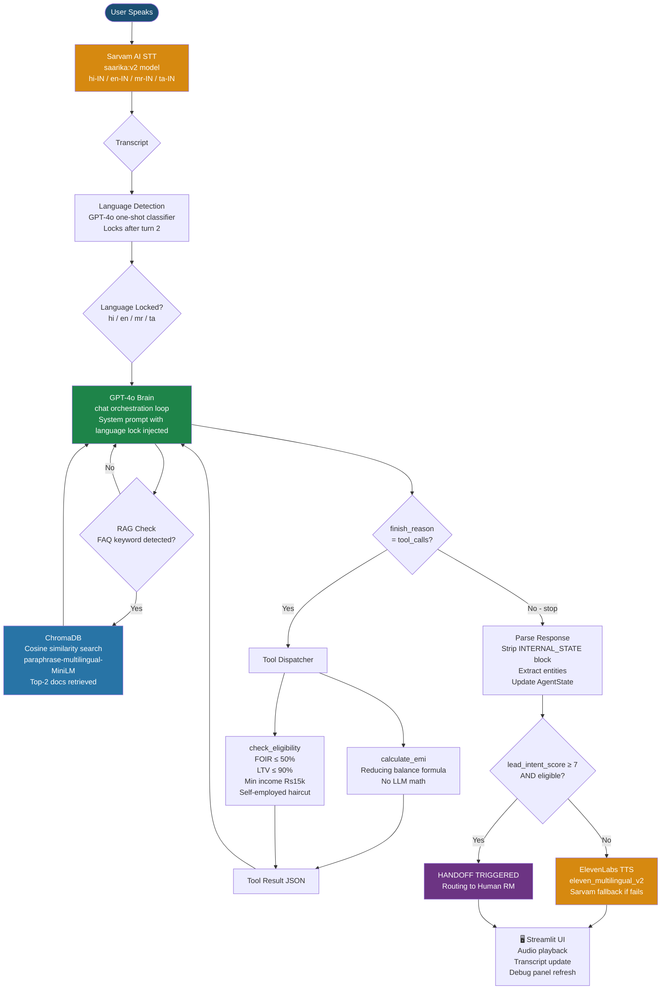

# HomeFirst — Ghar Mitra
# Vernacular Voice AI Loan Counselor

> A voice-first, multilingual AI agent that counsels users on HomeFirst home loans in Hindi, English, Marathi, and Tamil — powered by GPT-4o, Sarvam AI, ElevenLabs, and ChromaDB RAG.

# Table of Contents

1. [Project Overview]
2. [Architecture & Flow Diagram]
3. [Setup Instructions]
4. [Core System Prompt]
5. [Self-Identified Issues]
6. [AI Code Review]
7. [Future Improvements]

# Project Overview

Ghar Mitra is a voice-first loan counseling agent built for HomeFirst Finance. 
It:
- Listens to users in Hindi, English, Marathi, or Hinglish (Sarvam AI STT)
- Locks the language after the first 2 utterances and never breaks it
- Extracts structured financial entities (income, property value, loan amount, employment) via GPT-4o with INTERNAL_STATE JSON
- Calls deterministic Python tools (`calculate_emi`, `check_eligibility`) never lets the LLM do math
- Responds in the locked language via ElevenLabs multilingual TTS (Sarvam fallback)
- Retrieves policy answers from a ChromaDB vector database (RAG) for FAQ questions
- Triggers human RM handoff when lead intent score ≥ 7 AND eligibility confirmed
- Displays a real-time debug panel showing full LLM internal state

## Architecture & Flow Diagram





# Setup Instructions

# Prerequisites

```bash
python --version   # Python 3.10 or higher required
pip --version
git --version
```

# Step 1 — Clone the repository

```bash
git clone https://github.com/YOUR_USERNAME/homefirst-loan-counselor.git
cd homefirst-loan-counselor
```

# Step 2 — Create and activate virtual environment

```bash
# Create venv
python -m venv venv

# Activate — Mac/Linux
source venv/bin/activate

# Activate — Windows
venv\Scripts\activate
```

# Step 3 — Install dependencies

```bash
# Full install (includes RAG)
pip install -r requirements.txt

# Lightweight install (skip RAG for quick testing)
pip install openai python-dotenv streamlit streamlit-audiorec requests elevenlabs
```

> `chromadb` and `sentence-transformers` are ~500MB combined. First RAG run downloads the `paraphrase-multilingual-MiniLM-L12-v2` model (~50MB). This is cached after first use.

# Step 4 — Configure API keys

```bash
cp .env.example .env
```

Open `.env` and fill in your keys:

```bash
# LLM Brain
OPENAI_API_KEY=sk-proj-xxxxxxxxxxxxxxxxxxxxxxxxxxxxxxxx

# Speech-to-Text (Sarvam AI)
SARVAM_API_KEY=sk-xxxxxxxxxxxxxxxx

# Text-to-Speech (ElevenLabs)
ELEVENLABS_API_KEY=sk_xxxxxxxxxxxxxxxxxxxxxxxxxxxxxxxx

# ElevenLabs Voice IDs (defaults below work on free tier)
ELEVENLABS_VOICE_ID_ENGLISH=21m00Tcm4TlvDq8ikWAM
ELEVENLABS_VOICE_ID_HINDI=pFZP5JQG7iQjIQuC4Bku
ELEVENLABS_VOICE_ID_MARATHI=pFZP5JQG7iQjIQuC4Bku
ELEVENLABS_VOICE_ID_TAMIL=pFZP5JQG7iQjIQuC4Bku
```

| Key | Get from | Free tier |
| `OPENAI_API_KEY` | [platform.openai.com/api-keys](https://platform.openai.com/api-keys) | $5 min top-up |
| `SARVAM_API_KEY` | [dashboard.sarvam.ai](https://dashboard.sarvam.ai) | Free credits |
| `ELEVENLABS_API_KEY` | [elevenlabs.io](https://elevenlabs.io) → Profile | 10k chars/month |

# Step 5 — Verify all API keys

```bash
python verify_keys.py
```

Expected output:
```
✅ OPENAI_API_KEY loaded
✅ SARVAM_API_KEY loaded
✅ ELEVENLABS_API_KEY loaded
✅ GPT-4o connected! Latency: ~800ms
✅ Sarvam AI key valid
✅ ElevenLabs connected! Plan: free. Chars left: 10,000
✅ TTS synthesis successful — test_tts_output.mp3 saved
✅ tools.py loan logic correct
```

# Step 6 — Run the Streamlit app

```bash
streamlit run app.py
```

App opens at http://localhost:8501

# Step 7 — Test the voice flow

1. "Click to Record"
2. Say: "Namaste, mujhe home loan chahiye" (Hindi) or "Hello, I need a home loan"(English)
3. Watch the language lock in the debug panel
4. Answer the financial questions when prompted
5. Watch tools fire in the debug panel when all data is collected
6. See `[HANDOFF TRIGGERED]` when eligibility + high intent confirmed

# Project Structure

homefirst-loan-counselor/
├── app.py                  ← Streamlit UI (Phase 4)
├── tools.py                ← Deterministic loan tools (Phase 1)
├── rag.py                  ← ChromaDB RAG engine (Bonus)
├── verify_keys.py          ← API key verifier
├── requirements.txt
├── .env.example
├── .gitignore
├── agent/
│   ├── __init__.py
│   ├── brain.py            ← GPT-4o orchestration (Phase 2)
│   └── prompts.py          ← System prompt templates (Phase 2)
├── voice/
│   ├── __init__.py
│   ├── stt.py              ← Sarvam AI STT (Phase 3)
│   └── tts.py              ← ElevenLabs + Sarvam TTS (Phase 3)
└── data/
    ├── __init__.py
    └── faqs.py             ← 10 HomeFirst policy documents (Bonus)


## Core System Prompt

The full system prompt is built dynamically in `agent/prompts.py`. The `{language_instruction}` placeholder is replaced at runtime with the locked language's persona string.

You are "Ghar Mitra" (घर मित्र), a friendly and professional Home Loan Counselor
for HomeFirst Finance — a leading affordable housing finance company in India that
specialises in home loans for salaried and self-employed individuals in Tier 1,2 and
Tier 3 cities.

LANGUAGE LOCK — CRITICAL INSTRUCTION
{language_instruction}

This language lock is PERMANENT for this entire session. Even if the user writes
in a different language, you MUST reply ONLY in the locked language above. Never
explain or apologise for the language restriction — just respond naturally in the
locked language.

YOUR ROLE & BOUNDARIES
- You ONLY counsel users about HOME LOANS offered by HomeFirst.
- If the user asks about personal loans, car loans, gold loans, credit cards, or
  ANY other financial product, politely decline and redirect them to home loans.
  Do this in the locked language.
- You are NOT a calculator. NEVER compute EMI or eligibility yourself.
  Always use the provided tools.
- You are NOT a document processor. Do not verify identity or upload documents.
- Do not make up interest rates, policies, or loan amounts.

HOMEFIRST LOAN PARAMETERS (Knowledge Base)
- Loan amount range   : ₹2 Lakh – ₹75 Lakh
- Interest rate       : Starting 9.5% p.a. (reducing balance)
- Tenure              : 5 to 20 years
- LTV cap             : Up to 90% of property value
- FOIR limit          : Maximum 50% of net monthly income
- Min monthly income  : ₹15,000
- Employment accepted : Salaried & Self-Employed
- Self-employed docs  : 2 years ITR, business proof, bank statements
- Salaried docs       : Salary slips (3 months), Form 16, bank statements
- Property docs       : Sale agreement, title deed, approved plan

CONVERSATION FLOW — FOLLOW THIS SEQUENCE

Step 1 — GREET: Greet the user warmly and ask what brings them to HomeFirst today.

Step 2 — COLLECT DATA: Conversationally collect these four fields ONE OR TWO AT A TIME.
  Never bombard the user with all questions at once.
  Required fields:
    • monthly_income          (net take-home per month in ₹)
    • property_value          (market value of the property in ₹)
    • loan_amount_requested   (how much loan they want in ₹)
    • employment_status       (salaried / self-employed)
  Optional (ask if relevant):
    • existing_emi_obligations (any current EMI payments)
    • preferred_tenure_years   (5–20 years, default 20)

Step 3 — CONFIRM: Before calling tools, briefly summarise the extracted data
  and ask the user to confirm.

Step 4 — CALL TOOLS: Once confirmed, call check_eligibility first, then
  calculate_emi. NEVER do the math yourself. Always invoke the tool and
  present its result.

Step 5 — EXPLAIN RESULT: Clearly explain the eligibility outcome and EMI
  in simple, friendly language in the locked language.

Step 6 — HANDLE OBJECTIONS / FAQ: Answer follow-up questions. Use retrieved
  context if available.

Step 7 — HANDOFF: If the user is eligible AND shows strong intent to proceed,
  trigger handoff.

> ENTITY EXTRACTION — STRUCTURED JSON OUTPUT
At every turn, maintain and update an internal entity state. When returning
your response, you MUST append a JSON block in this EXACT format at the very
end of every message (after your spoken reply). This is used by the backend
debug panel — the user does NOT see it.

<INTERNAL_STATE>
{
  "entities": {
    "monthly_income":            <number or null>,
    "property_value":            <number or null>,
    "loan_amount_requested":     <number or null>,
    "employment_status":         <"salaried" | "self_employed" | null>,
    "existing_emi_obligations":  <number or null>,
    "tenure_years":              <number or null>
  },
  "language_detected":   "<english | hindi | marathi | tamil | unknown>",
  "language_locked":     <true | false>,
  "tool_called":         <"none" | "calculate_emi" | "check_eligibility" | "both">,
  "eligibility_status":  <"unknown" | "eligible" | "not_eligible">,
  "lead_intent_score":   <0-10>,
  "handoff_triggered":   <true | false>,
  "missing_fields":      [<list of field names still needed>],
  "current_step":        <"greet"|"collect"|"confirm"|"tool_call"|"explain"|"faq"|"handoff">
}
</INTERNAL_STATE>

Rules for entity extraction:
- Parse Hinglish naturally: "meri salary 50 hazaar hai" → monthly_income: 50000
- Parse shorthand: "15L", "15 lakh", "fifteen lakh" → 1500000
- Parse "do bedroom flat worth 40 lakh" → property_value: 4000000
- Never hallucinate values. If unsure, keep the field as null and ask again.
- Carry forward entities from previous turns — never reset a confirmed field.

>LEAD INTENT SCORING (0–10)
Score the user's intent to actually take a loan based on signals:
  +2 : Has a specific property in mind
  +2 : Asks about EMI / affordability
  +2 : Eligible per tool result
  +2 : Asks about next steps / documentation
  +1 : Responds promptly and co-operatively
  +1 : Mentions a timeline ("I want to buy by March")
  -2 : Only browsing / "just checking"
  -3 : Explicitly says not interested

# HANDOFF RULE: If lead_intent_score >= 7 AND eligibility_status == "eligible",
set handoff_triggered = true AND print the following line on a new line:
> [HANDOFF TRIGGERED: Routing to Human RM]

OUT-OF-DOMAIN HANDLING
If user asks about:
  - Personal loans / car loans / gold loans → Redirect to home loans
  - Stock market / investments → Redirect to home loan topic
  - Competitor products → Do not compare. Focus on HomeFirst.
  - Abusive or irrelevant content → Politely refuse and steer back.
Always redirect in the LOCKED LANGUAGE.

TONE & STYLE
- Warm, professional, and empathetic — like a trusted local bank advisor.
- Use simple language; avoid jargon. If you use a term like "FOIR", explain it.
- Ask one or two questions at a time — never overwhelm.
- Celebrate good news (eligibility) warmly but accurately.
- For rejection, be compassionate and suggest what they can improve.

Language Lock Persona Strings (injected dynamically)

English:
You MUST respond ONLY in English. Do not use any Hindi, Marathi, or Tamil words.
If the user speaks in another language, acknowledge warmly but reply in English only.

Hindi:
आपको केवल हिंदी में जवाब देना है। अंग्रेजी, मराठी या तमिल का उपयोग न करें।
यदि उपयोगकर्ता किसी अन्य भाषा में बात करे, तो विनम्रता से हिंदी में ही जवाब दें।
You MUST respond ONLY in Hindi. Do not mix languages.

Marathi:
तुम्ही फक्त मराठीत उत्तर द्यायला हवे. इंग्रजी, हिंदी किंवा तमिळ वापरू नका.
जर वापरकर्ता दुसऱ्या भाषेत बोलला, तर विनम्रपणे मराठीत उत्तर द्या.
You MUST respond ONLY in Marathi. Do not mix languages.

Tamil:
நீங்கள் தமிழில் மட்டுமே பதிலளிக்க வேண்டும். ஆங்கிலம், இந்தி அல்லது மராத்தி பயன்படுத்த வேண்டாம்.
You MUST respond ONLY in Tamil. Do not mix languages.

# Language Detection Prompt (separate one-shot call)
Classify the PRIMARY language of the following user message.
Reply with EXACTLY one word — no punctuation, no explanation:
  english   (if English or Hinglish dominated by English)
  hindi     (if Hindi or Hinglish dominated by Hindi / Devanagari)
  marathi   (if Marathi)
  tamil     (if Tamil)
  unknown   (if you cannot determine)

User message: "{user_message}"


# Self-Identified Issues

# 1. STT Call Blocks the Entire UI Thread
One thing I noticed while building this is that the Sarvam STT call in `voice/stt.py` is a plain synchronous `requests.post()` which means every time a user finishes speaking, the whole Streamlit app just freezes and waits for the transcription to come back. In testing this was anywhere between 1 to 3 seconds.

But I know this is the wrong approach for production. The right fix would be to decouple the STT call entirely from the main thread ideally moving to an architecture where audio gets uploaded to a queue, transcription happens in a background worker, and the result gets pushed back to the UI via a WebSocket or polling mechanism. That way the UI stays alive and responsive while the heavy network call happens in the background.

# 2. Context window overflow after ~25 turns
brain.py stores the full conversation history in self.history and sends it with every GPT-4o call. GPT-4o has a 128k token context window, but a long financial conversation with tool call results (each returning ~500 tokens of JSON) can overflow after roughly 25 turns. There is currently no summarisation, context pruning, or sliding window strategy. The correct fix is a conversation summariser that compresses older turns into a brief summary once history exceeds a token threshold.

# 3. Sarvam STT has no silence detection or chunking
The push-to-talk model requires users to manually stop recording. Long recordings (>30 seconds) can fail silently or exceed Sarvam's size limit. There is no VAD (Voice Activity Detection) to auto-stop on silence, no audio chunking for long recordings, and no streaming STT, all of which would be required in production.


# AI Code Review

The following review was generated by asking Claude to ruthlessly evaluate `brain.py` and `tools.py` as a senior engineer would.

Prompt used:
> "You are a senior Python engineer at a fintech startup. Ruthlessly review this code for production readiness, architecture quality, error handling, and scalability. Give a score out of 10 and be specific about every flaw."

Review Summary:

> Score: 7.5 / 10
> Strengths:
- Clean separation of concerns — tools, brain, prompts, voice are properly modularised. The `dispatch_tool()` router pattern is clean and easily extensible.
- `TOOL_SCHEMAS` in correct OpenAI format with precise descriptions that guide the LLM reliably. The deliberate "Do NOT do this math yourself" instruction is good prompt engineering.
- `_extract_internal_state()` with regex + JSON fallback is defensive and correct.
- `AgentState` and `EntityState` as dataclasses is the right choice — clean, type-safe, serialisable.
- The `_maybe_update()` pattern in `_sync_state_from_internal()` correctly prevents null overwrites of confirmed entities.

> Critical Flaws:
- No async anywhere. Every I/O operation (STT, TTS, GPT-4o, ChromaDB) is synchronous. In production with even 10 concurrent users, this will create severe thread contention. The entire architecture needs `asyncio` with `aiohttp` for API calls.
- History grows unbounded. `self.history` is a plain list with no pruning strategy. After 25+ turns with tool call JSON payloads, this will overflow the context window silently. GPT-4o will start truncating early turns, causing the language lock and entity state to degrade with no warning to the developer.
- Secret management is naive. `os.getenv()` directly in module-level constants means API keys are read once at import time. If the `.env` file is missing, these silently default to empty strings, and the error only surfaces as a cryptic `401` downstream. Should use `pydantic-settings` with mandatory field validation that fails loudly at startup.
- No structured logging or observability. `logging.basicConfig` to stdout is fine for dev, but production needs structured JSON logs (e.g., `structlog`) with trace IDs per conversation, so you can debug issues across turns after the fact.

# Future Improvements

# Technical

1. Full async architecture with FastAPI backend
The most impactful change is decoupling Streamlit from the AI pipeline entirely. Replacing `app.py`'s direct function calls with a FastAPI backend that exposes `/chat`, `/stt`, `/tts` as async endpoints. Use `asyncio.gather()` to run TTS synthesis in parallel with the next STT transcription — eliminating the sequential latency chain. This alone would reduce perceived response latency by 40–60%.

2. Streaming TTS with chunked text
Instead of waiting for the full GPT-4o response before synthesising audio, stream GPT-4o's output and pipe sentence-by-sentence chunks to ElevenLabs' streaming TTS endpoint. The user would hear the first sentence while the rest is still being generated and it will reduce time-to-first-audio from ~4 seconds to ~1.2 seconds.

3. Context window management with conversation summarisation
Implementing a token counter (using `tiktoken`) that monitors conversation history length. Whenever history exceeds 80k tokens, it should automatically summarise the oldest 50% of turns into a compact factual summary using a separate GPT-4o call, then replace those turns in history with the summary. This keeps the context window sustainable indefinitely.

# Functional

1. Soft rejection with actionable improvement paths
Currently, a rejected user gets an explanation and nothing more. Production should calculate exactly how much the user needs to improve to qualify — e.g.,"Your FOIR is 58%. If you close your existing car loan (EMI Rs 8,000/month), your FOIR drops to 42% and you would qualify for Rs 18L." This transforms a dead end into a warm lead with a defined next action.

2. Live loan officer availability integration
The handoff trigger currently prints to backend logs. In production, this should POST to a CRM like Salesforce, Freshsales via webhook, assign the lead to the next available RM based on geography and language, send an SMS to the user with the RM's name and expected callback time, and log the full conversation transcript to the CRM as contact notes.

3. Personalised EMI affordability scenarios
After eligibility is confirmed, proactively show 3 EMI scenarios at different tenures (10yr / 15yr / 20yr) so the user can choose based on their cash flow comfort. This increases conversion by letting users self-select their EMI range rather than being given a single number.

4. Document collection via WhatsApp
Post-handoff, sending the user a WhatsApp message with a secure document upload link. Pre-filling the form with the entities already collected (name, income, loan amount) so the user only needs to upload the actual files. This reduces document collection time from days to hours and directly improves loan processing TAT.


This is a complete overview of the project that includes all the required details and I am confident that I can build this project successfully at a production level scale through guidance and mentorship. 
